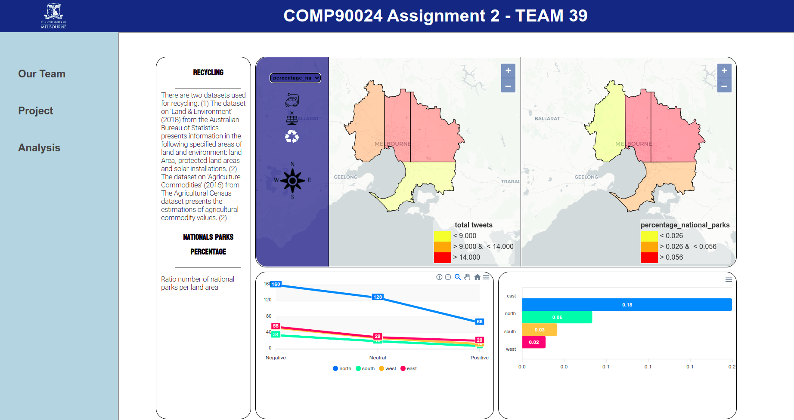
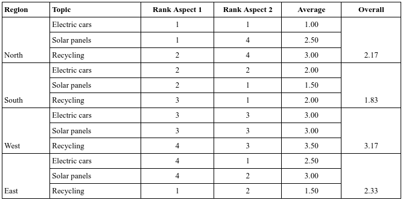
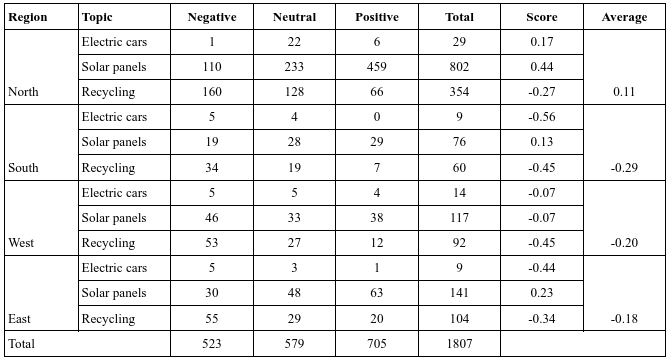
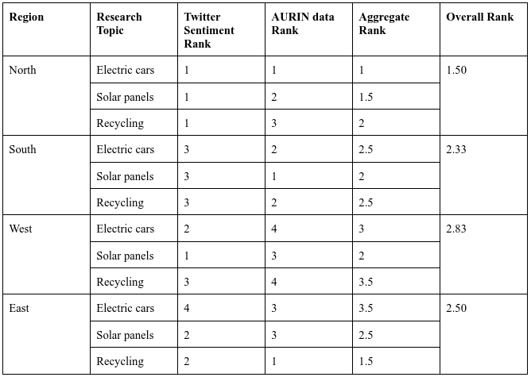

# COMP90024-assignment2

The project is deployed to [http://172.26.129.118:30080](http://172.26.129.118:30080)



## Contributors
* [Lulu Ilmaknun Qurotaini](https://github.com/luluilmaknun) - 1328810 - lulu.qurotaini@student.unimelb.edu.au
* [Fathima Risla Jabarullah](https://github.com/rizlajf) - 1138005- jabarullahf@student.unimelb.edu.au
* [Abdul Hannan Ghafoor](https://github.com/AH-G) - 1136001 - abdulhannan.ghafoor@student.unimelb.edu.au
* [Jack William Barrett](https://github.com/shitathakin) - 832556 - jbarrett2@student.unimelb.edu.au
* [Gyu Hwan Park](https://github.com/rbghks0126) - 998174 - gyu.park@student.unimelb.edu.au

Note: farispabe account refer to Lulu's account


## Abstract
In this report, we described our cloud-hosted application that used Twitter and Australian Urban Research Infrastructure Network (AURIN) data to derive insights into the liveability, in terms of sustainable trends, of different regions of the Greater Melbourne area. Our application was deployed on the Melbourne Research Cloud, a public cloud service providing free on-demand computing resources to researchers at the University of Melbourne. For system architecture and design, our whole application included the Twitter harvester, CouchDB, backend and frontend services being deployed on docker containers which are managed by Kubernetes. For the tweeter harvester, we used the Twitter API via Python and a pre-trained transformer-based model for sentiment analyzer. MapReduce capabilities were used for distributed computation and aggregation of Twitter data using CouchDB’s builtin capabilities. Backend was built on Flask, allowing seamless communication between the processed data in CouchDB and the frontend developed using the Angular and react frameworks. Further data analyses and user-guide can be found in the last sections of the report.


## Documentation
* Videos Demonstration: https://youtu.be/JQ_1yM8Kkgw
* Report: https://drive.google.com/file/d/1ykK7J8CRvaFpjtyFoMywpvz92hFJq_B7/view?usp=sharing
* Presentation Slide: https://docs.google.com/presentation/d/13eWcpEkUPPv9VHGR_XIE4fh1aA93Kn8-D64NlGJRrzY/edit?usp=sharing

## Deployment guide
1. Clone the repo
2. Run the `requirements.sh`
3. For the default configuration, run       `ansible-playbook ccc39.yaml -i inventory.txt -vv`
4. For the above command, it is assumed that you already have a 4 node setup which has 3 volumes attached to the workers nodes. The information about the security groups that are needed to be attached to the VM is present in the `host_vars/nectar.yaml` file.
5. Please update the `inventory.txt` file before running the playbook with the details of the setup along with the information of the keys files
6. If you want to deploy the openstack VMs so that the whole application is deployed dynamically, please remove the comments in the `ccc39.yaml` file
7. For that you don't need the inventory file. 
8. For dynamic deployment, please source the openrc file first of the project space and then run the command `ansible-playbook ccc39.yaml -vv`


## Development guide
### Backend
Backend is used to fetch data from couchdb. The backend uses `Flask==1.1.4` in `>Python 3.6` with the following dependencies:

```
Flask==1.1.4
Flask-Cors==3.0.10
Flask-RESTful==0.3.9
MarkupSafe==2.0.1
```

**To run:**
1. `cd` into `web/backend`
2. Run command `pip install -r requirements.txt` to install all dependencies
3. Run app with `python app.py`

The app should be running on port `8081`

### Frontend - Map component
**Map component should be run separately from the website!**

**To run:**
1. `cd` into `web/frontend/map-component`
2. Run the command "npm i" to install the dependencies
3. Run the command "npm start" to build and start the application in one go

The component should be running on port `3000` (need to be called by the website)

### Frontend - Website

**To run:**
1. `cd` into `web/frontend`
1. Run the command "npm i" to install the dependencies
2. Run the command "npm run start" to build and start the application in one go

The component should be running on port `4200`

## Data Analysis Result

Result of AURIN data analysis:


Result of Twitter sentiment analysis:


Result of Overall analysis:


According to the ranking system described, north was the most liveable region in relation to the topic of electric cars, whereas east was the worst. With regards to recycling, east was the most and least liveable regions, respectively. For solar panels, it was north, south, west, and east, respectively. Finally, from the overall rank that combines the ranks for three research topics altogether, the north region of the Greater Melbourne area was deemed to be the most liveable region, with west coming last.
